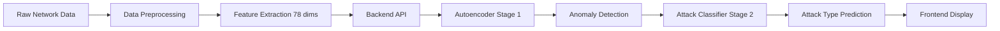
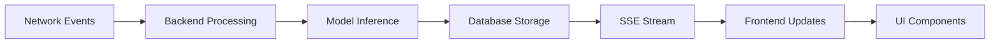

# Backend-Frontend Integration Plan
## Federated Anomaly Detection System

### Overview
This document outlines the comprehensive plan to integrate the backend and frontend components to work seamlessly with your current AI model (Enhanced Two-Stage Autoencoder + Attack Type Classifier).

### Current System Architecture

#### Backend Components
- **FastAPI Server** (`backend/main.py`, `backend/api_server.py`)
- **AI Model**: Enhanced Two-Stage Autoencoder with Attack Type Classification
- **Database**: Supabase integration
- **XAI Integration**: SHAP explanations
- **Federated Learning**: Client-server architecture

#### Frontend Components
- **React + TypeScript** application
- **UI Framework**: Radix UI + Tailwind CSS
- **State Management**: TanStack Query
- **API Client**: Custom API layer with fallbacks

---

## Phase 1: Backend API Enhancement

### 1.1 Model Integration Improvements

**Current Issues:**
- Backend has two different API servers (`main.py` and `api_server.py`)
- Model loading logic is duplicated
- Two-stage prediction not fully exposed

**Required Changes:**

#### A. Consolidate API Servers
```python
# backend/main.py - Primary server
# Merge functionality from api_server.py
# Add two-stage prediction endpoints
```

#### B. Enhanced Model Endpoints
```python
# New endpoints to add:
POST /model/detect-two-stage
{
  "features": [[...]], # 78 features
  "threshold": 0.22610116
}

Response:
{
  "anomaly_predictions": [0, 1, 0, ...],
  "reconstruction_errors": [0.1, 0.8, 0.2, ...],
  "attack_type_predictions": [0, 2, 0, ...], # Only for anomalies
  "attack_confidences": [1.0, 0.85, 1.0, ...],
  "attack_types": ["BENIGN", "DoS GoldenEye", "DoS Hulk", "DoS Slowhttptest", "DoS slowloris"]
}
```

#### C. Model Loading Optimization
```python
# backend/models/model_loader.py
class EnhancedModelLoader:
    def load_two_stage_model(self):
        # Load both autoencoder and attack classifier
        # Validate model compatibility
        # Return model metadata
```

### 1.2 Feature Standardization

**Current Issue:** Frontend expects 9 features, model uses 78 features

**Solution:**
```python
# backend/routes/model_routes.py
@app.post("/model/detect-enhanced")
async def detect_anomalies_enhanced(request: EnhancedDetectionRequest):
    """
    Enhanced detection with feature validation and transformation
    """
    # Validate 78 features
    # Apply same preprocessing as training
    # Return two-stage results
```

### 1.3 Real-time Updates Implementation

**Current State:** Mock real-time endpoint

**Enhancement:**
```python
# backend/routes/realtime_routes.py
@app.get("/realtime/stream")
async def stream_realtime_anomalies():
    """Server-Sent Events for real-time anomaly updates"""
    return EventSourceResponse(anomaly_generator())
```

---

## Phase 2: Frontend API Client Updates

### 2.1 API Configuration Enhancement

**File:** `frontend/src/config/api.ts`

```typescript
export const API_CONFIG = {
  BASE_URL: import.meta.env.VITE_API_URL || 'http://localhost:8000',
  TIMEOUT: 30000,
  RETRY_ATTEMPTS: 3,
  MODEL_CONFIG: {
    INPUT_DIMENSIONS: 78,
    THRESHOLD: 0.22610116,
    ATTACK_TYPES: ['BENIGN', 'DoS GoldenEye', 'DoS Hulk', 'DoS Slowhttptest', 'DoS slowloris']
  }
};
```

### 2.2 Enhanced API Types

**File:** `frontend/src/types/api.ts`

```typescript
export interface EnhancedDetectionRequest {
  features: number[][];
  threshold?: number;
}

export interface EnhancedDetectionResponse {
  anomaly_predictions: number[];
  reconstruction_errors: number[];
  attack_type_predictions: number[];
  attack_confidences: number[];
  attack_types: string[];
}

export interface ModelInfo {
  model_path: string;
  input_dim: number;
  last_trained: string;
  accuracy: number | null;
  status: 'loaded' | 'not_loaded' | 'training';
  two_stage_enabled: boolean;
  attack_types: string[];
}
```

### 2.3 Updated API Client

**File:** `frontend/src/api/enhanced-api.ts`

```typescript
export const enhancedModelApi = {
  detectAnomaliesTwoStage: async (request: EnhancedDetectionRequest): Promise<EnhancedDetectionResponse> => {
    return await apiCall('/model/detect-two-stage', {
      method: 'POST',
      body: JSON.stringify(request),
    });
  },

  getEnhancedModelInfo: async (): Promise<ModelInfo> => {
    return await apiCall('/model/info-enhanced');
  },

  // Real-time SSE connection
  subscribeToRealTimeAnomalies: (callback: (anomaly: AnomalyData) => void) => {
    const eventSource = new EventSource(`${API_BASE_URL}/realtime/stream`);
    
    eventSource.onmessage = (event) => {
      const anomaly = JSON.parse(event.data);
      callback(anomaly);
    };

    return eventSource;
  }
};
```

---

## Phase 3: Frontend Component Updates

### 3.1 Dashboard Enhancements

**File:** `frontend/src/pages/Dashboard.tsx`

**Updates Required:**
- Display two-stage prediction results
- Show attack type classifications
- Real-time anomaly updates
- Model status indicator

```typescript
// New components to add:
<AttackTypeDistribution />
<RealTimeAnomalyFeed />
<ModelPerformanceMetrics />
<TwoStagePredictionResults />
```

### 3.2 Anomaly Management Page

**File:** `frontend/src/pages/Anomalies.tsx`

**Enhancements:**
- Attack type filtering
- SHAP explanations integration
- Batch review functionality
- Export capabilities

### 3.3 Model Management Page

**File:** `frontend/src/pages/ModelManagement.tsx`

**New Features:**
- Two-stage model training controls
- Attack classifier metrics
- Model version comparison
- Feature importance visualization

### 3.4 XAI Explanation Page

**File:** `frontend/src/pages/XAIExplanation.tsx`

**Enhancements:**
- SHAP value visualization
- Attack type explanations
- Feature contribution charts
- Interactive explanations

---

## Phase 4: Data Flow Integration

### 4.1 Feature Processing Pipeline



### 4.2 Real-time Data Flow



---

## Phase 5: Environment Configuration

### 5.1 Backend Environment Variables

```bash
# .env
PORT=8000
ENVIRONMENT=development
CORS_ORIGINS=http://localhost:5173,http://localhost:3000
LOG_LEVEL=INFO

# Database
SUPABASE_URL=your_supabase_url
SUPABASE_KEY=your_supabase_key

# Model Configuration
MODEL_PATH=model_artifacts/best_autoencoder_fixed.pth
INPUT_DIMENSIONS=78
ANOMALY_THRESHOLD=0.22610116
```

### 5.2 Frontend Environment Variables

```bash
# frontend/.env
VITE_API_URL=http://localhost:8000
VITE_APP_NAME=Federated Anomaly Detection
VITE_APP_VERSION=2.0.0
VITE_ENVIRONMENT=development
```

---

## Phase 6: Testing Strategy

### 6.1 Backend Testing

```python
# tests/test_integration.py
def test_two_stage_prediction():
    """Test complete two-stage prediction pipeline"""
    
def test_feature_validation():
    """Test 78-feature input validation"""
    
def test_real_time_streaming():
    """Test SSE streaming functionality"""
```

### 6.2 Frontend Testing

```typescript
// frontend/src/tests/integration.test.tsx
describe('Model Integration', () => {
  test('Two-stage prediction workflow');
  test('Real-time anomaly updates');
  test('SHAP explanation display');
});
```

---

## Phase 7: Deployment Configuration

### 7.1 Production Backend Setup

```dockerfile
# Dockerfile.backend
FROM python:3.11-slim
WORKDIR /app
COPY requirements.txt .
RUN pip install -r requirements.txt
COPY . .
EXPOSE 8000
CMD ["uvicorn", "main:app", "--host", "0.0.0.0", "--port", "8000"]
```

### 7.2 Production Frontend Setup

```dockerfile
# Dockerfile.frontend
FROM node:18-alpine
WORKDIR /app
COPY package*.json ./
RUN npm ci
COPY . .
RUN npm run build
FROM nginx:alpine
COPY --from=0 /app/dist /usr/share/nginx/html
```

---

## Phase 8: Monitoring & Analytics

### 8.1 Backend Monitoring

```python
# backend/monitoring/metrics.py
class ModelMetrics:
    def track_prediction_latency(self):
        # Track model inference time
    
    def track_accuracy_metrics(self):
        # Track model performance
    
    def track_system_health(self):
        # Track system resources
```

### 8.2 Frontend Analytics

```typescript
// frontend/src/analytics/tracking.ts
export const analytics = {
  trackUserInteraction: (action: string, data: any) => {
    // Track user interactions
  },
  
  trackModelUsage: (modelType: string, features: number[]) => {
    // Track model usage patterns
  }
};
```

---

## Implementation Timeline

### Week 1: Backend API Enhancement
- [ ] Consolidate API servers
- [ ] Implement two-stage prediction endpoints
- [ ] Add real-time streaming
- [ ] Update model loading logic

### Week 2: Frontend API Client
- [ ] Update API types
- [ ] Implement enhanced API client
- [ ] Add error handling
- [ ] Implement real-time connections

### Week 3: Frontend Components
- [ ] Update Dashboard with two-stage results
- [ ] Enhance Anomaly management page
- [ ] Improve Model management interface
- [ ] Update XAI explanation page

### Week 4: Integration & Testing
- [ ] End-to-end integration testing
- [ ] Performance optimization
- [ ] User acceptance testing
- [ ] Documentation updates

### Week 5: Deployment & Monitoring
- [ ] Production deployment setup
- [ ] Monitoring implementation
- [ ] Performance tuning
- [ ] Go-live preparation

---

## Success Criteria

### Technical Metrics
- [ ] API response time < 500ms for predictions
- [ ] Real-time updates < 1s latency
- [ ] 99.9% API uptime
- [ ] Zero data loss in streaming

### User Experience Metrics
- [ ] Intuitive two-stage result display
- [ ] Real-time anomaly notifications
- [ ] Comprehensive XAI explanations
- [ ] Responsive design on all devices

### Model Integration Metrics
- [ ] Seamless 78-feature processing
- [ ] Accurate attack type classification
- [ ] Consistent SHAP explanations
- [ ] Model version management

---

## Risk Mitigation

### Technical Risks
1. **Model Loading Failures**
   - Implement fallback models
   - Add comprehensive error handling
   - Model health checks

2. **Performance Bottlenecks**
   - Implement caching strategies
   - Optimize database queries
   - Load testing

3. **Real-time Connection Issues**
   - Implement reconnection logic
   - Add connection health monitoring
   - Fallback to polling

### User Experience Risks
1. **Complex Two-Stage Results**
   - Clear visualization design
   - User education features
   - Progressive disclosure

2. **Real-time Overload**
   - Rate limiting
   - User-configurable updates
   - Smart filtering

---

## Conclusion

This integration plan ensures that the frontend and backend work seamlessly with your enhanced two-stage AI model. The phased approach allows for incremental development, testing, and deployment while maintaining system stability and user experience quality.

Key focus areas:
1. **Model Integration**: Full two-stage prediction support
2. **Real-time Capabilities**: Live anomaly detection and updates
3. **User Experience**: Intuitive interface for complex results
4. **Scalability**: Production-ready architecture
5. **Maintainability**: Clean, documented, and testable code

The implementation will result in a cohesive system that leverages your advanced AI model capabilities while providing an excellent user experience.
