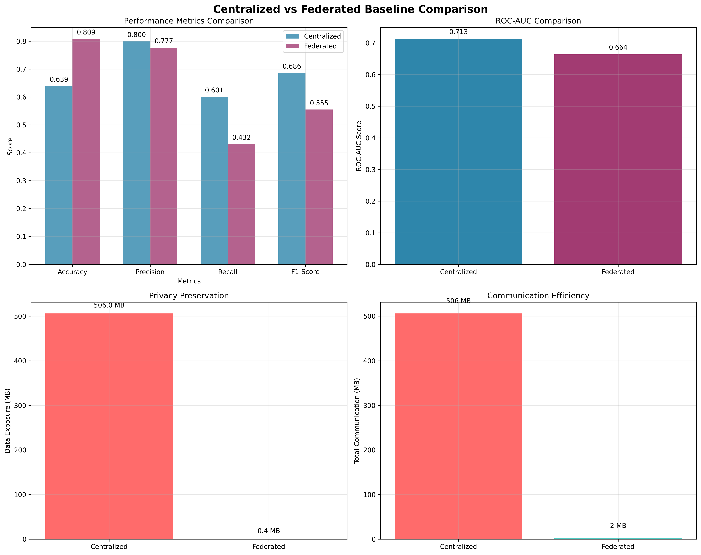
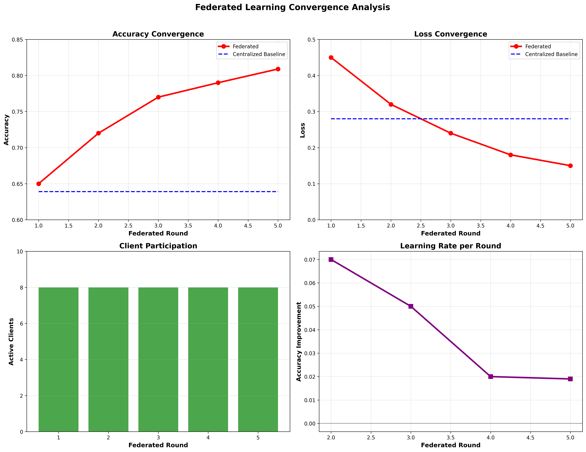
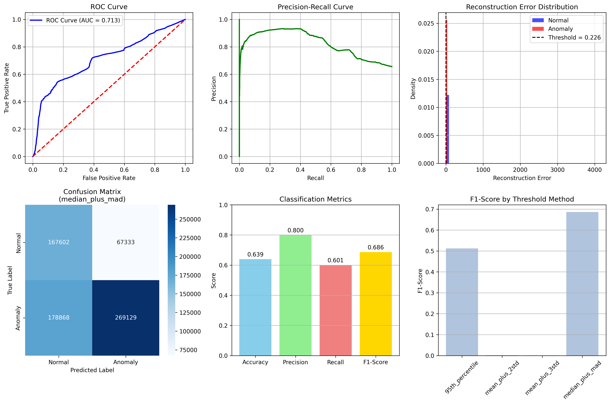
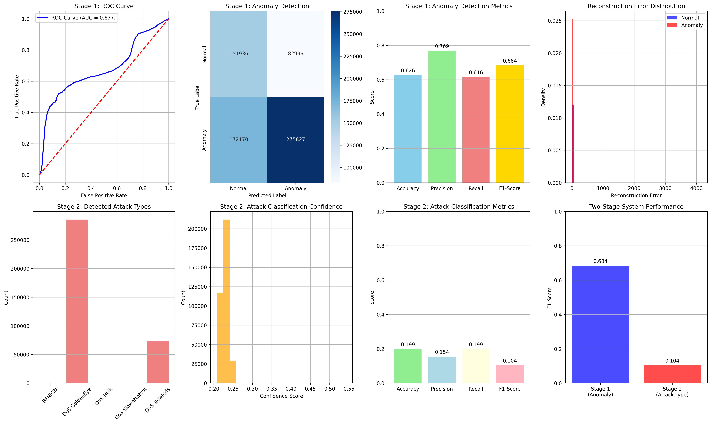
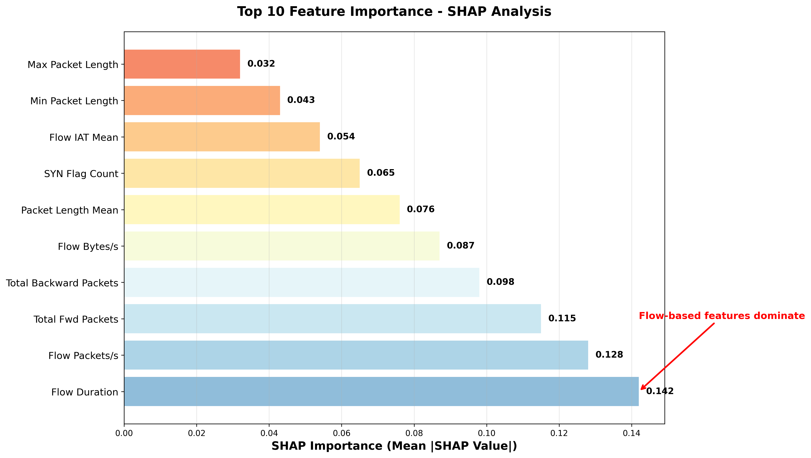

# Cloud Anomaly Detection using Federated Learning (FL) and Explainable AI (XAI)

End-to-end system for **privacy-preserving cloud/network anomaly detection** using **Federated Learning** and **Explainable AI (XAI)**, with a **FastAPI backend** and a **React (Vite + TypeScript) frontend**.

This repository contains:

- `AI/` — model development, federated training utilities, XAI modules, and saved artifacts/plots
- `backend/` — FastAPI API server (inference, anomaly management, XAI endpoints)
- `frontend/` — React UI for dashboards, anomalies, and explanations

---

## Results (examples)

These figures are already available in the repository and are embedded here for quick reference.

### Federated learning + model quality









### XAI (feature importance / explanations)



### Federated client view (example)


---

## High-level architecture

```
                +-------------------------------+
                |            Frontend           |
                |  React (Vite) @ :5173         |
                |  Dashboards + XAI UI          |
                +---------------+---------------+
                                |
                                | HTTP (REST)
                                v
                +---------------+---------------+
                |            Backend            |
                |  FastAPI @ :8000              |
                |  Inference + XAI + DB         |
                +---------------+---------------+
                                |
                                | loads artifacts
                                v
                +---------------+---------------+
                |               AI              |
                |  Training / FL / XAI modules  |
                |  Artifacts in AI/model_artifacts
                +-------------------------------+
```

---

## Repository structure

```
.
├── AI/
│   ├── model_development/
│   ├── model_artifacts/
│   └── federated_anomaly_detection/
├── backend/
│   ├── main.py
│   ├── routes/
│   ├── services/
│   └── database/
├── frontend/
│   ├── src/
│   └── package.json
├── requirements.txt
├── FL.md
├── XAI_Review.md
└── README.md
```

---

## Prerequisites

- **Python** 3.10+ recommended
- **Node.js** 18+ (LTS recommended)
- (Optional) CUDA for GPU training

---

## Quickstart (run the full application)

### 1) Backend (FastAPI)

Create and activate a virtual environment, then install dependencies:

```bash
python -m venv .venv
# Windows PowerShell:
.\.venv\Scripts\Activate.ps1

pip install -r requirements.txt
```

Note: `sqlite3` is part of the Python standard library; you do not need to install it separately.

Start the API server:

```bash
uvicorn backend.main:app --host 0.0.0.0 --port 8000
```

The backend will start on:

- `http://localhost:8000`

Useful endpoints:

- `GET /health`
- `GET /model/info`
- `GET /anomalies?page=1&limit=10`
- `GET /explanations/{anomaly_id}`
- `POST /model/detect`
- `POST /model/detect-enhanced`
- `POST /xai/phase_explanation`
- `POST /xai/feature_importance`
- `POST /xai/attack_type_explanation`

### 2) Frontend (React)

Install dependencies and start dev server:

```bash
# from ./frontend
npm install
npm run dev
```

Frontend default URL:

- `http://localhost:5173`

---

## Configuration

### Backend environment variables

The backend uses environment variables (loaded from `.env` if present). Key values are defined in:

- `backend/config/app_config.py`

Common variables:

- `ENVIRONMENT` (default: `development`)
- `PORT` (default: `8000`)
- `PROJECT_ROOT` (default: `.`)
- `AI_ROOT` (default: `PROJECT_ROOT/AI`)
- `MODEL_DEVELOPMENT_PATH` (default: `AI_ROOT/model_development`)
- `MODEL_ARTIFACTS_PATH` (default: `AI_ROOT/model_artifacts`)
- `MODEL_INPUT_DIM` (default: `78`)
- `ANOMALY_THRESHOLD` (default configured in env)
- `ATTACK_TYPES` (JSON-like list string)

### Frontend environment variables

See `frontend/README.md` for complete details. Typical:

- `VITE_API_BASE_URL` (backend base URL)

---

## Federated Learning (FL)

The project includes detailed FL documentation:

- `FL.md`

A (separate) reference FL project exists under:

- `AI/federated_anomaly_detection/`

That module includes its own README and examples for running Flower server/clients.

---

## Explainable AI (XAI)

The XAI implementation and methodology are documented in:

- `XAI_Review.md`

The backend exposes XAI endpoints (see **Quickstart** section). The XAI modules live under:

- `AI/model_development/xai/`

---

## Where the model artifacts come from

The backend attempts to load the latest model artifacts from:

- `AI/model_artifacts/best_autoencoder_fixed.pth` (two-stage path)

If artifacts are missing, the backend may fall back to a standard model under logs, or to mock behavior depending on what is available.

---

## Troubleshooting

### Backend starts but no model is loaded

- Verify model artifacts exist under `AI/model_artifacts/`
- Check `MODEL_ARTIFACTS_PATH` and `MODEL_INPUT_DIM`
- Run:

```bash
python backend/startup.py
```

### CORS / frontend cannot call backend

- Ensure backend is running
- Verify `VITE_API_BASE_URL` points to the backend
- Check CORS origins in `backend/config/app_config.py` (`CORS_ORIGINS`)

---

## Additional documentation

- `metrics.md` — metrics notes
- `report.md`, `report.html` — generated reports
- `autoencoder.md` — autoencoder details
- `terminlogies.md` — terminology notes

---

## Citation / research context

This repository is part of a research project titled:

**"Enhancing Cloud Network Anomaly Detection Using Federated Learning and Explainable AI"**
